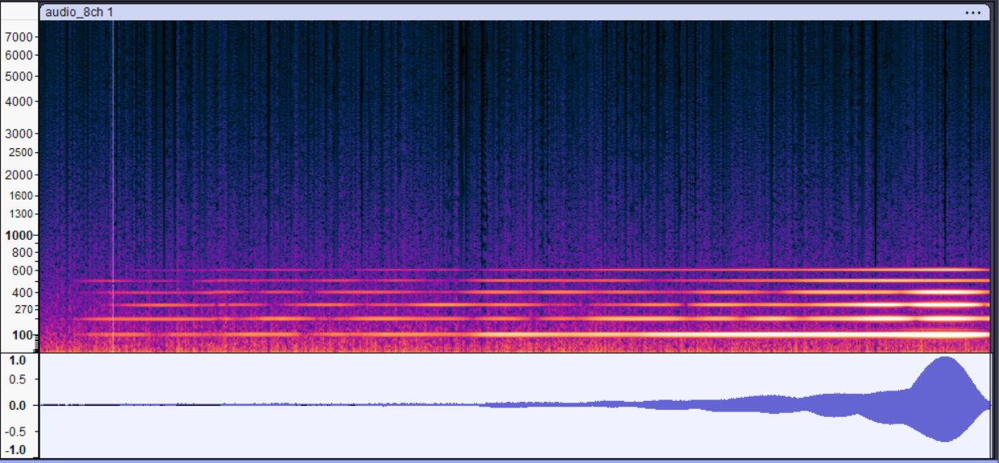
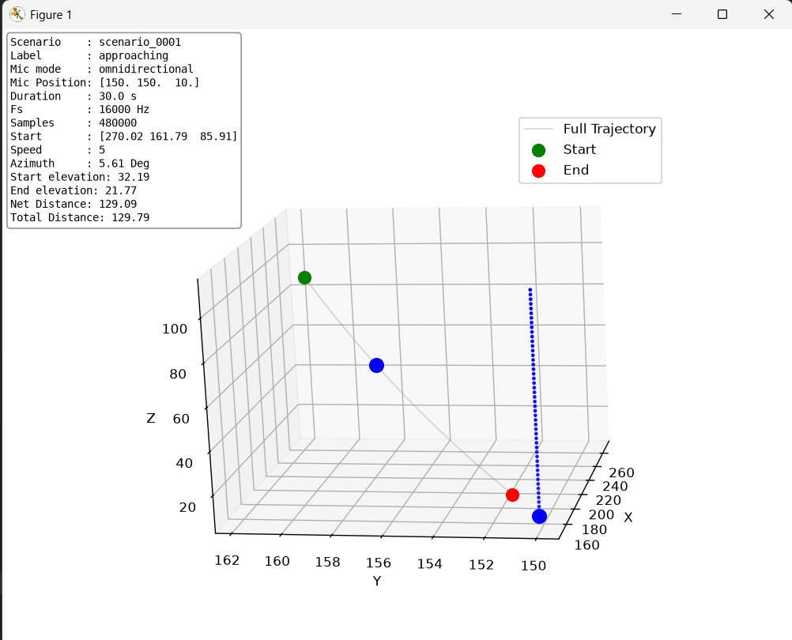
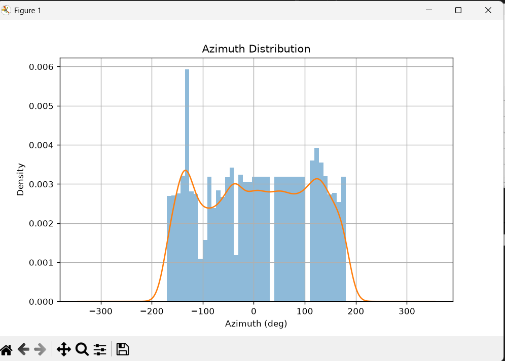

# UAV Audio Dataset Generator

A configurable Python framework for generating synthetic multichannel UAV (drone) audio datasets. The project simulates drone trajectories, acoustic propagation, environmental noise, and microphone array recordings, producing synchronized audio and metadata suitable for machine learning research.

---

## Test Audio Sepctogram 


# Features

- Configurable outdoor acoustic environments
- Multiple microphone array geometries
- Physically-inspired drone sound synthesis
- Dynamic drone trajectories
- Doppler effect synthesis
- Visuals for data distributions
- Environmental noise simulation
- Multichannel WAV generation
- Metadata generation for supervised learning
- Easily extensible configuration system

---

# Project Goal

The objective of this project is to generate realistic synthetic datasets for training deep learning models to estimate drone characteristics from audio.

Typical prediction targets include:

- Drone presence
- Azimuth
- Elevation
- Distance
- Motion type
- Radial velocity
- Drone class

The generator creates synchronized:

- Multi-channel audio
- Ground-truth metadata
- Trajectory information

---

# Dataset Generation Pipeline

```
Configuration
      │
      ▼
Trajectory Generator
      │
      ▼
Drone Audio Synthesizer
      │
      ▼
Outdoor Acoustic Simulator
      │
      ▼
Environmental Noise Generator
      │
      ▼
Multi-channel Recording
      │
      ▼
Metadata Writer
```

---

# Configuration

Everything is controlled using Python configuration variables.

## Outdoor Environment

Defines the simulated acoustic environment.

Example:

```python
outdoors = [
{
    "name": "urban_suburban",
    "description": "...",

    "width": 1000.0,
    "depth": 1000.0,
    "height": 1000.0,

    "wall_material": "wood_1.6cm",
    "ground_material": "linoleum_on_concrete",
    "sky_material": "anechoic",

    "max_rir_order": 2,
    "air_absorption": True,

    "wall_scattering": 0.25,
    "ground_scattering": 0.10
}
]
```

### Parameters

| Parameter | Description |
|------------|-------------|
| width | Environment width (m) |
| depth | Environment depth (m) |
| height | Environment height (m) |
| wall_material | Reflection material |
| ground_material | Ground reflection material |
| sky_material | Ceiling/sky material |
| max_rir_order | Maximum reflection order |
| air_absorption | Enable atmospheric attenuation |
| wall_scattering | Wall diffusion coefficient |
| ground_scattering | Ground diffusion coefficient |

---

# Microphone Array

Defines the recording array.

Example

```python
mic_arrays = [
{
    "name": "circular_omni_8ch_compact",

    "n_mics": 8,

    "center": [150,150,10],

    "mic_mode": "omnidirectional",

    "radius": 0.05,

    "cardioid_p": 0.5
}
]
```

### Parameters

| Parameter | Description |
|------------|-------------|
| n_mics | Number of microphones |
| center | Array center (x,y,z) |
| mic_mode | Omnidirectional or directional |
| radius | Radius of circular array |
| cardioid_p | Directivity coefficient |

---

# Drone Model

Defines the drone sound.

Example

```python
drones = [
{
    "name":"quadcopter_commercial_standard",

    "rotor_base_hz":100,

    "n_harmonics":6,

    "harmonic_decay":0.55,

    "source_rms":0.7
}
]
```

### Parameters

| Parameter | Description |
|------------|-------------|
| rotor_base_hz | Rotor blade frequency |
| n_harmonics | Number of synthesized harmonics |
| harmonic_decay | Harmonic amplitude decay |
| source_rms | Output signal RMS level |

---

# Environmental Noise

Background ambient noise.

Example

```python
env_noises = [
{
    "name":"urban_downtown_heavy_traffic",

    "wind_rms":0.01,

    "wind_gust_prob":0.0005,

    "wind_gust_amp":0.03,

    "traffic_rms":0.08,

    "impulse_prob":0.001,

    "impulse_amp":0.3,

    "noise_seed":42
}
]
```

### Components

- Wind noise
- Wind gusts
- Traffic noise
- Random impulse events

---

# Acoustic Simulation

Simulation parameters.

```python
sims = [
{
    "fs":16000,

    "sound_speed":343,

    "n_rir_snapshots":16
}
]
```

### Parameters

| Parameter | Description |
|------------|-------------|
| fs | Sample rate |
| sound_speed | Speed of sound (m/s) |
| n_rir_snapshots | Number of RIR snapshots |

---

# Trajectory Configuration

Dataset duration

```python
duration_s = 30
```

Trajectory labels

```python
labels = [
    "approaching",
    "flyby",
    "hover"
]
```

Training speeds

```python
speeds_train = [
    4
]
```

Training azimuths

```python
azimuths_train = [
    0,
    10
]
```

These values are combined to generate all desired scenarios.

---

# Generated Dataset

Example directory

```
dataset/

    approaching/

        sample_0001/

            audio.wav

            metadata.json

        sample_0002/

    flyby/

    hover/
```

---

# Metadata Example

```json
{
  "scenario": "scenario_000",
  "label": "approaching",
  "duration_s": 30.0,
  "mic_mode": "omnidirectional",
  "cardioid_p": null,
  "audio": {
    "sample_rate_hz": 16000,
    "n_channels": 8,
    "array_center_m": [
      150.0,
      150.0,
      10.0
    ],
    "array_radius_m": 0.05
  },
  "outdoor_env": {
    "dimensions_m": [
      1000.0,
      1000.0,
      1000.0
    ],
    "wall_material": "wood_1.6cm",
    "ground_material": "linoleum_on_concrete",
    "sky_material": "anechoic",
    "max_rir_order": 2
  },
  "samples": [
    {
      "sample_idx": 0,
      "time_s": 0.0,
      "position_m": [
        241.127,
        150.0,
        78.497
      ],
      "velocity_ms": [
        -1.79,
        0.0,
        -3.221
      ],
      "distance_m": 114.0,
      "radial_speed_ms": -3.3663,
      "motion": "approaching",
      "azimuth_deg": 0.0,
      "elevation_deg": 36.93,
      "tdoa_us": [
        0.0,
        34.139,
        116.545,
        198.93,
        233.049,
        198.93,
        116.545,
        34.139
      ]
    },
    {
      "sample_idx": 160,
      "time_s": 0.01,
      "position_m": [
        241.109,
        150.0,
        78.465
      ],
      "velocity_ms": [
        -1.791,
        0.0,
        -3.22
      ],
      "distance_m": 113.966,
      "radial_speed_ms": -3.3663,
      "motion": "approaching",
      "azimuth_deg": 0.0,
      "elevation_deg": 36.92,
      "tdoa_us": [
        0.0,
        34.143,
        116.557,
        198.95,
        233.072,
        198.95,
        116.557,
        34.143
      ]
    }]
}
```

---

# Audio Output

Each recording is

- 8 channels
- 16 kHz
- Floating point WAV
- Time synchronized

---

# Extending the Generator

Adding new scenarios only requires creating new configuration entries.

Examples:

- New outdoor environments
- New microphone arrays
- New drone models
- New environmental noise profiles
- New trajectory generators

No changes to the generation pipeline are required.

---

# Typical Workflow

1. Define environments.
2. Define microphone arrays.
3. Define drone models.
4. Define environmental noise.
5. Configure simulation settings.
6. Select trajectory labels.
7. Select drone speeds.
8. Select azimuth angles.
9. Run the dataset generator.
10. Train machine learning models using the generated audio and metadata.

---

# Future Extensions

Possible future additions include

- Weather-dependent propagation
- Multiple simultaneous drones
- Doppler refinement
- Terrain elevation
- Buildings and obstacle occlusion
- Directional microphones
- Multiple microphone array layouts
- Real drone recordings for domain adaptation
- Dataset balancing utilities

---
## Usage Guide

This tool uses nested commands (subparsers) to separate actions. The two primary modes are `run` and `plot`.

### 1. Generate Audio Data
To execute the audio generation batch process, run:

```bash
python main.py run
```

### 2. Plotting Visualizations

The plot command requires an additional sub-command specifying what type of plot you want to generate.

### Option A: Spatial Trajectories
Plots the directional path of a specific scenario ID.

```bash
python main.py plot trajectory [--scenario SCENARIO_ID]

python main.py plot trajectory --scenario 0
```

Flags:

--scenario: (Optional, Default: 0) The integer ID of the scenario. The system automatically pads this to a 4-digit string (e.g., --scenario 5 looks for 0005).



### Option B: Data Distributions
Plots the frequency distribution of a chosen metric across the dataset.
```bash
python main.py plot distribution [--feature FEATURE_NAME]

python main.py plot distribution --feature velocity
```
Flags:
--feature: (Optional) The specific metric to plot.
Allowed Choices: velocity, azimuth, distance, elevation



| Command | Sub-command | Flags | Description |
|---|---|---|---|
| `run` | — | — | Launches the audio data generation sequence. |
| `plot` | `trajectory` | `--scenario <int>` | Visualizes spatial paths for a given scenario number. |
| `plot` | `distribution` | `--feature <name>` | Graphs distributions for velocity, azimuth, distance, or elevation. |


# License
MIT

---

# Author

UAV Audio Dataset Generator
Synthetic Multichannel Acoustic Dataset Generation for Machine Learning